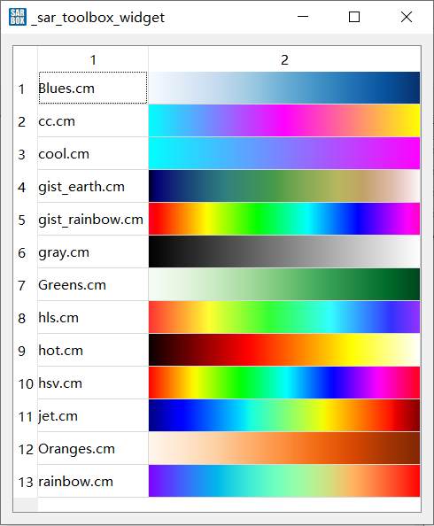

# Section.02 TableWidget

[toc]

## setCellWidget存放QWidget

QTableWidget可以**存放QWidget**，以**颜色表展示**窗口为例。

通过很多前缀操作，得到一个绘制颜色表信息的QWidget的子类“linear_garadient_wgt”, 需要在tablewidget中展示这些颜色表信息。

代码如下：

```C++
/// 展示界面的构造函数
///“colortable_display_wgt::colortable_display_wgt(QWidget *parent) : QWidget(parent)”中
///(考虑到之后可能是一个子模块，所以没有用QDialog, 而是QWidget)

table_widget = new QTableWidget(this);
table_widget->setColumnCount(2);
/// .... 生成颜色表linear_garadient_wgt的中间过程
table_widget->setRowCount(colortable_path.size());

int i=0;
for(auto iter: colortable_path)
{
    linear_gradient_wgt* wgt = new linear_gradient_wgt(table_widget);
    QMap<double,QColor> map = wgt->read_cm_file(iter);
    wgt->get_colormap(map);
    QLabel *label = new QLabel(table_widget);
    label->setText(QFileInfo(iter).fileName());
    /// 向表格中添加QWidget
    table_widget->setCellWidget(i,0,label);
    table_widget->setCellWidget(i,1,wgt);
    i++;
}

```

显示效果如下：



## 表格属性设置
